# 🧩 Dynamic Server Loader

> ### Dynamic Hosting Files for **BSNL gd_ent**
> This repository contains configuration and content files used for **dynamic web hosting** on BSNL’s **gd_ent** broadband service.
It includes essential **HTML**, **CSS**, **JavaScript**, and **JSON** files for redirect management, message handling, and service connectivity.

---

## 🌐 Web Access

  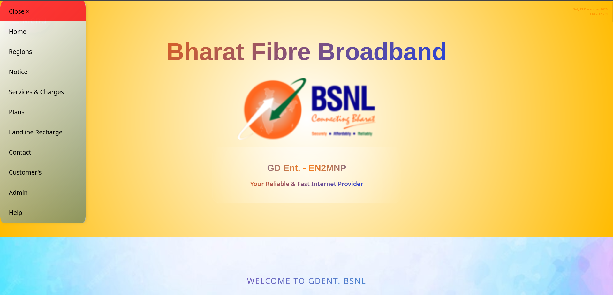
  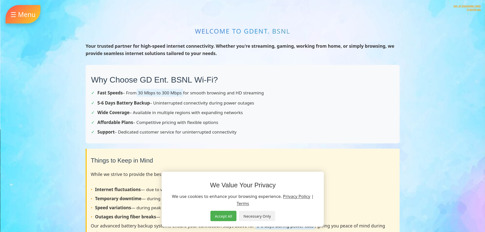

  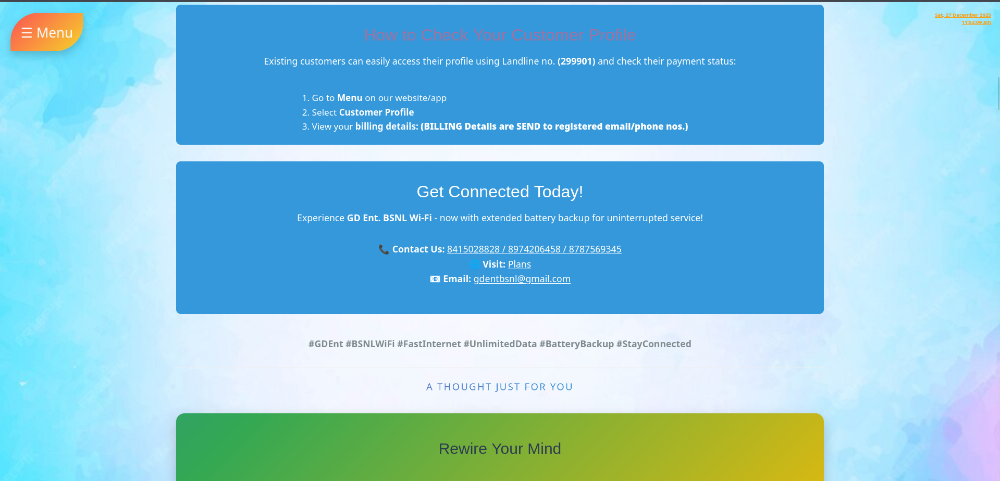
  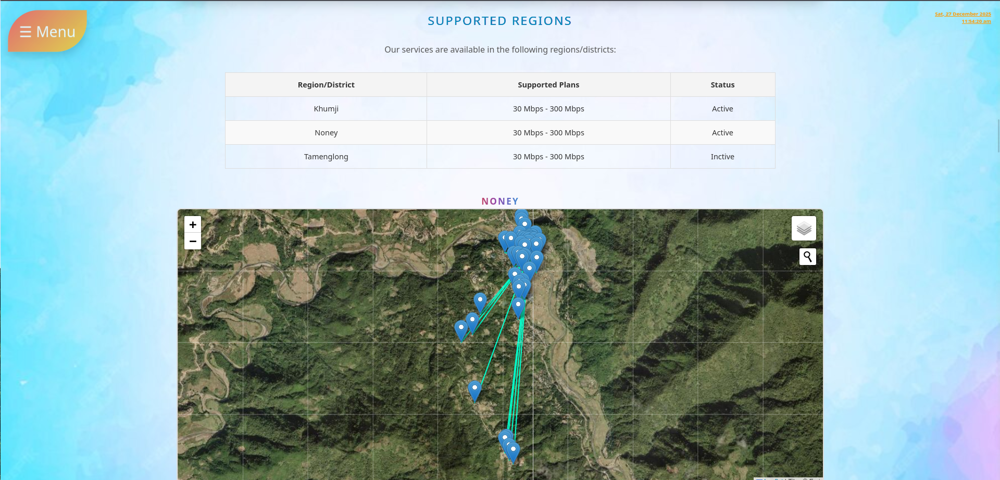

  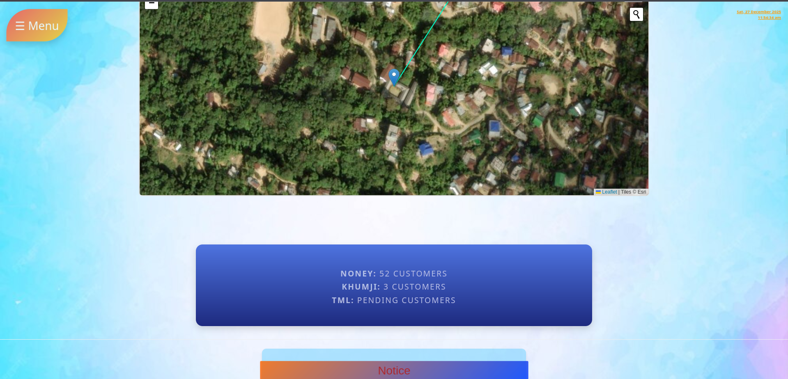
  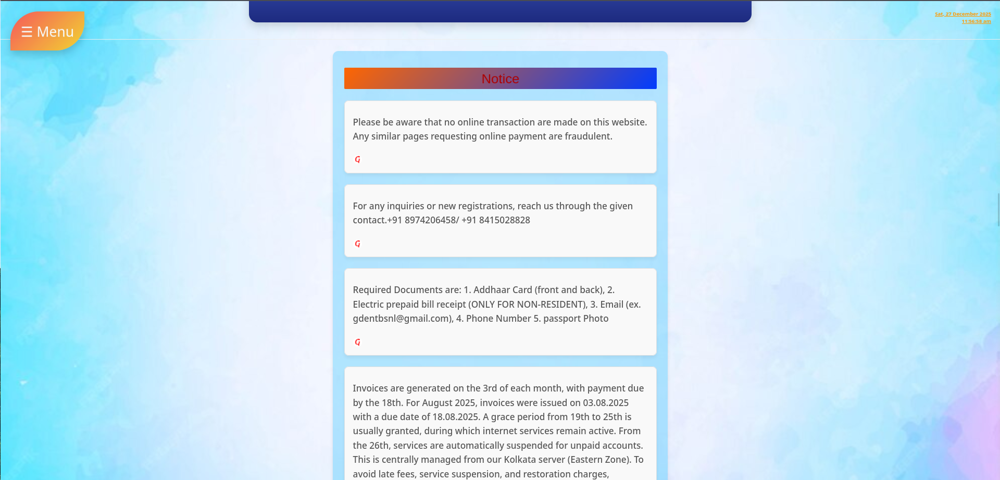

  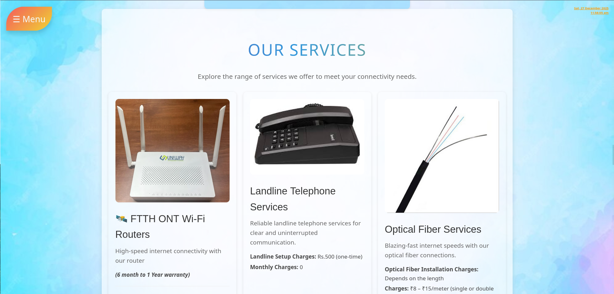
  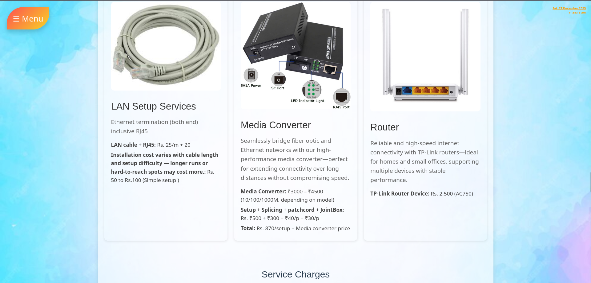

  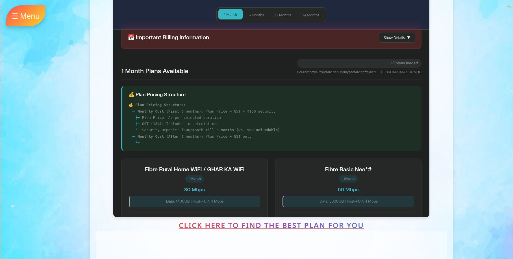
  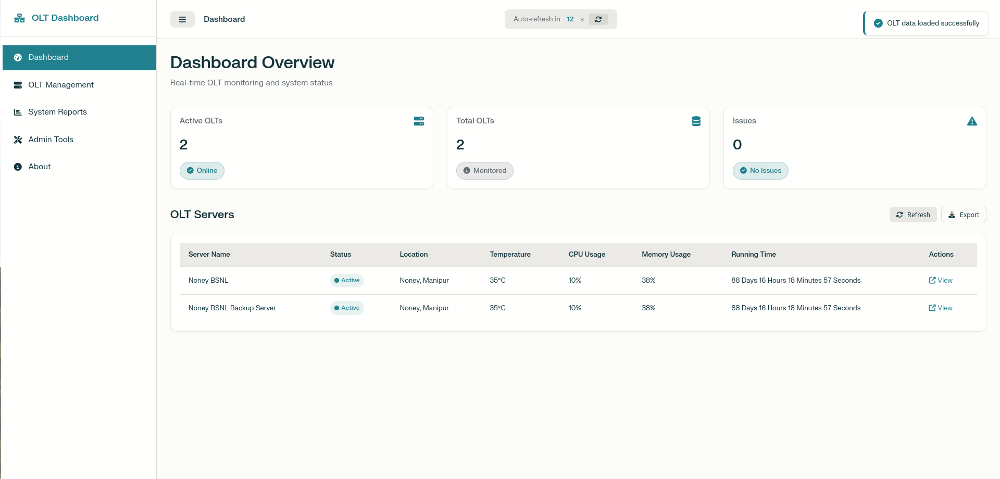

  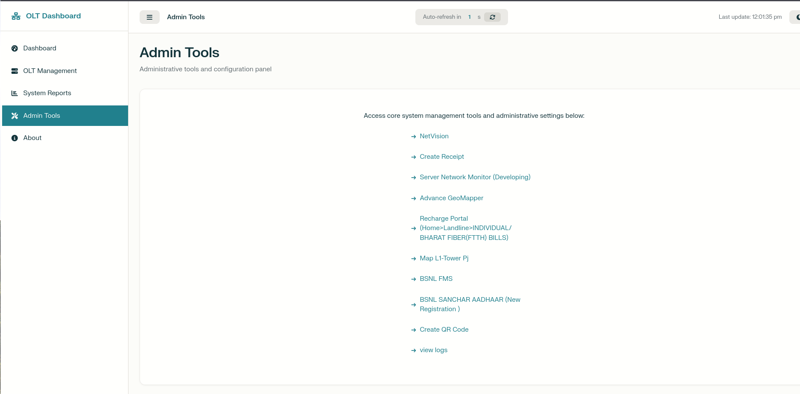
  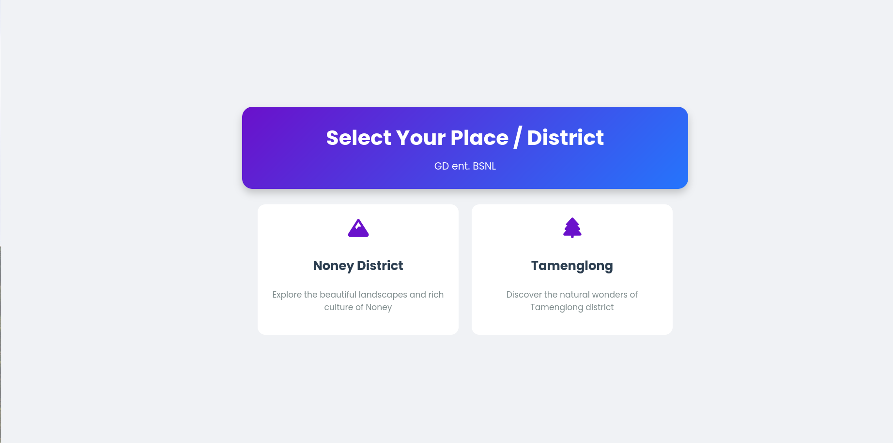

  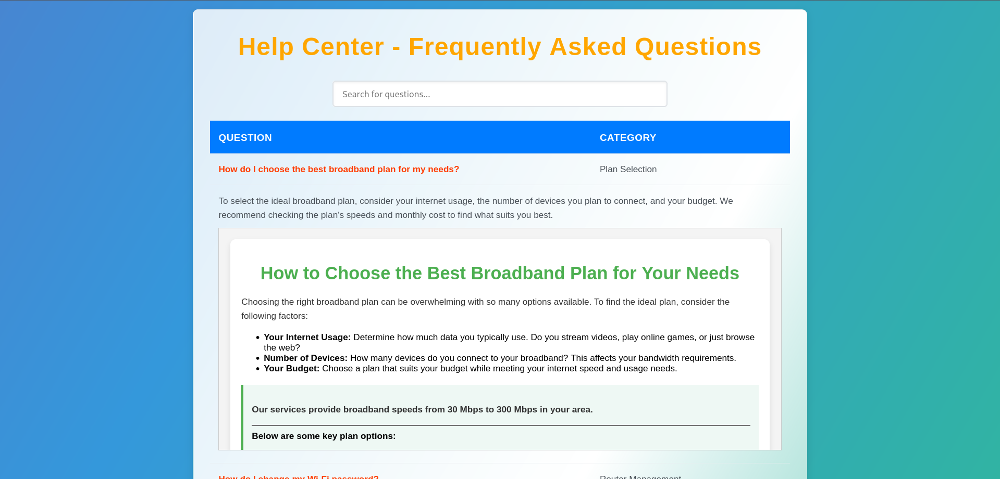

**Public Link:** [https://guang84.github.io/noneybsnl/](https://guang84.github.io/noneybsnl/)

> 💡 Click the link above to visit the **NONEY BSNL Broadband Service** (SERVER DOWN).

---

> ## ⚙️ About the Project
> This repository was created to provide a **stable online endpoint** for BSNL’s **NONEY broadband service**.
Since the **local server links frequently changed**, this GitHub-hosted version served as a **dynamic connector**—allowing customers and broadband systems to consistently access or redirect to the correct local server.

> #### The full application ran on a **local BSNL web server**, handling dynamic operations, user routing, and data exchanges.

> ✅ **Project Highlights:**
> * Fully implemented and operated successfully for a years.
> * Served as a reliable redirect and connection point between customers and the Noney BSNL broadband server.
> * Hosted via GitHub Pages for stability and testing  when local server updates & URLs changed.
 
---

> ## 🛠️ Local Setup (Optional)
>Contact dev

> ## 📫 Project Status
> ✅ **Project Completed** — Successfully deployed and operated for years on BSNL’s broadband network.
> 🔌 **Server Offline** — The local server has been shut down due to the discontinuation of my role at NONEY BSNL broadband service.
> 💼 **Available for Purchase** — The full application is available for acquisition, exclusively for **BSNL broadband deployment**.

---
