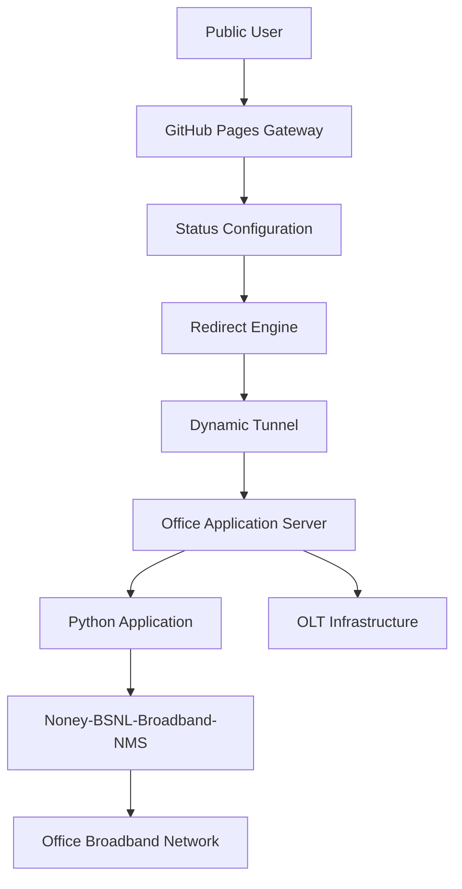

# Noney-BSNL-Broadband-NMS

> **Broadband Network Management System (NMS)**
>
> An independently developed Broadband Network Management System designed to support customer services, network operations, infrastructure planning, monitoring, and administrative workflows for a local BSNL Broadband Franchise.


>
> This repository serves as:
>
> - A public showcase of the project
> - A static gateway for deployment redirection
> - Documentation and screenshots of the system
> - Demonstration of architecture and operational workflows
>
> The production application, internal configurations, and server-side source code remain private.

---

# Table of Contents

- [Overview](#overview)
- [Live Access](#live-access)
- [Project Background](#project-background)
- [Key Features](#key-features)
- [Technology Stack](#technology-stack)
- [Static Gateway Architecture](#static-gateway-architecture)
- [Production Environment](#production-environment)
- [Deployment Architecture](#deployment-architecture)
- [Repository Structure](#repository-structure)
- [Application Screenshots](#application-screenshots)
- [Demonstration Videos](#demonstration-videos)
- [Documentation](#documentation)
- [Project Workflow](#project-workflow)
- [Current Status](#current-status)
- [Roadmap](#roadmap)
- [What This Project Demonstrates](#what-this-project-demonstrates)
- [License](#license)
- [Disclaimer](#disclaimer)
- [Contact](#contact)

---

# Overview

Noney-BSNL-Broadband-NMS was developed as a centralized platform to simplify daily ISP operations and improve customer service delivery.

The system combines:

- Customer services
- Administrative workflows
- Network monitoring
- Infrastructure documentation
- Geo mapping and route planning
- Broadband information management
- Operational reporting
- Public information delivery

into a single web-based platform.

The production environment was hosted on a local Python application server within the broadband office network.

GitHub Pages served as a permanent public gateway, while dynamic tunnel endpoints were used to provide secure external access to the locally hosted application.

This repository contains the public-facing deployment files, documentation, screenshots, and demonstration materials.

---

# Live Access

| Item | Details |
|------|----------|
| Repository | https://github.com/Guang84/Noney-BSNL-Broadband-NMS |
| Public Gateway | GitHub Pages |
| Current Status | Offline |
| Production Environment | Retired |

---

# Project Background

This project was developed from practical operational challenges encountered while supporting a newly established broadband franchise in a rural environment with limited resources and technical support.

Many operational activities relied heavily on manual processes, including:

- Customer management
- Infrastructure documentation
- Network planning
- Service information delivery
- Fault tracking
- Monitoring and reporting

The objective was to create practical software solutions tailored to the operational requirements of a local broadband service provider.

---

# Key Features

| Area | Capabilities |
|------|--------------|
| Customer Services | Customer information, broadband plans, service notices, FAQs, contact information, registration requests, and public service portal |
| Network Operations | Broadband connection management, GPON / OLT operations, leased line support, fiber infrastructure tracking, network monitoring, latency monitoring, and fault reporting |
| Administration | Administrative dashboard, customer record management, complaint handling, operational logging, reporting, and configuration management |
| Network Management | Infrastructure documentation, operational monitoring, service management tools, and support for administrative workflows related to GPON and OLT environments |
| Utilities | QR code generation, geo mapping, network visualization, route visualization, and point-to-point network details |
| Deployment | GitHub Pages gateway, redirect management, production status handling, maintenance page support, and public access routing |

---

## Geo Mapping

Advanced network planning tools for:

- Cable route calculations
- Distance measurements
- Route tracing
- Shortest path estimation
- Installation planning
- Site surveys
- Infrastructure documentation
- Network expansion planning

Supports inspection of:

- Splitters
- Routers
- Distribution points
- Customer endpoints
- Network elements

---

## NetVision

Interactive network visualization for displaying:

- Fiber routes
- Customer endpoints
- Network topology
- Cable lengths
- Service areas
- Broadband infrastructure information
- Network hierarchy

Designed to improve operational analysis and administration.

---

# Static Gateway Architecture

This repository also acted as a permanent public entry point for the production application.

Because the local server was hosted using a dynamic tunnel, the public URL could remain unchanged by using GitHub Pages as a stable gateway.

### Gateway Features

- Permanent public URL
- Status checking
- JSON-based configuration
- Automatic redirection
- Maintenance page support
- Deployment status handling

---

# Production Environment

The production application was hosted on a local office server and operated within the broadband office network.

The application supported:

- Customer service operations
- Administrative workflows
- Network monitoring
- Infrastructure documentation
- Broadband management activities
- Network planning and visualization

Certain modules were designed to support workflows related to GPON and OLT administration.

Implementation details and internal configurations are intentionally excluded from this repository.

---

# Deployment Architecture


```mermaid
flowchart TD

A[Public User]
B[GitHub Pages Gateway]
C[Status Configuration]
D[Redirect Engine]
E[Dynamic Tunnel]

F[Office Application Server]
G[Python Application]
H[Noney-BSNL-Broadband-NMS]
I[Office Broadband Network]
J[OLT Infrastructure]

A --> B
B --> C
C --> D
D --> E
E --> F

F --> G
G --> H

H --> I
F --> J
```


---

# Application Screenshots

| View | Preview |
|------|----------|
| Admin Panel |  |
| Network Visualisation |  |
| System & Server Monitor |  |
| Customer Portal |  |
| Settings Manager |  |
| System Reports |  |
| Server Logs & Admin Audit |  |
| Geo Mapping |  |

---

# Demonstration Videos

A short demonstration on network visualisation is available:

- `demo/netvisualisation/Screencast_20260708_121106.webm`

---

# Documentation

Supporting public documentation and project resources are available under:

```text
docs/
```

---

# Current Status

| Item | Status |
|------|---------|
| Development | Completed |
| Production Validation | Production Tested |
| Repository | Portfolio Showcase |
| Public Gateway | online |
| Production Server | Retired : Offline |

---


# What This Project Demonstrates

- Full-stack Web Development
- Python Application Development
- Linux Administration
- Network Operations
- GPON Knowledge
- Infrastructure Planning
- Network Monitoring
- Systems Integration Design
- Deployment Planning
- Problem Solving
- Software Design from Real-World Requirements

---


# Note

> Developed independently to solve practical ISP operational challenges using self-driven learning, software engineering, and real-world experience.
