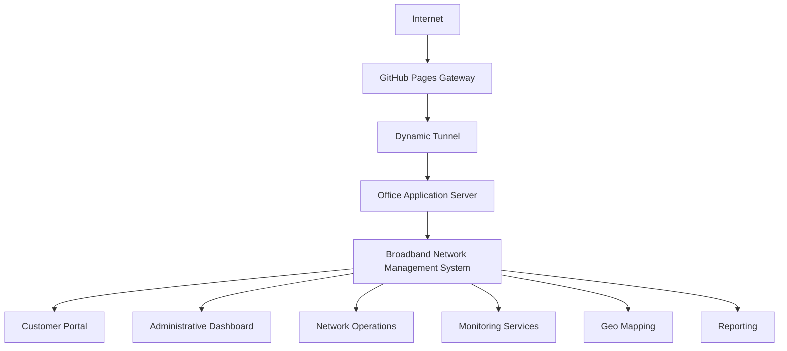
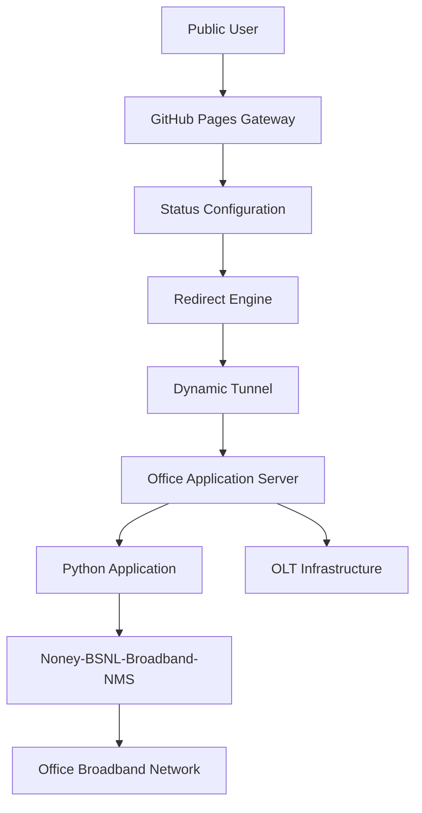

# Noney-BSNL-Broadband-NMS

> **Broadband Network Management System (NMS)**
>
> An independently developed ISP Operations and Broadband Management Platform designed to support customer services, network operations, infrastructure planning, monitoring, and administrative workflows for a local BSNL Broadband Franchise.

---

# Executive Summary

Noney-BSNL-Broadband-NMS is an independently designed and developed Broadband Network Management System (NMS) created to support the operations of a local BSNL broadband franchise.

The project was built entirely from practical experience and operational challenges encountered while managing a newly established broadband service in a rural environment with limited technical resources and support.

The system was developed to bridge operational gaps in:

- Customer management
- Service information delivery
- Network visualization
- Infrastructure planning
- Network monitoring
- Administrative workflows
- Field operations support
- Infrastructure documentation

The platform served as a centralized solution for managing daily broadband operations, customer requests, network planning, monitoring, and public service information.

---

# Project Background

The local broadband franchise was newly established and operated with:

- Limited resources
- Minimal technical infrastructure
- Limited operational support
- Lack of dedicated software solutions
- Heavy reliance on manual processes

Many operational activities such as:

- Customer management
- Network planning
- Infrastructure documentation
- Service information management
- Fault tracking
- Network monitoring

relied heavily on manual documentation.

The objective of this project was to create practical software solutions tailored to the operational requirements of a BSNL broadband service provider.

---

# Project Goals

- Simplify customer management
- Digitize operational workflows
- Improve service delivery
- Support network planning and visualization
- Reduce manual administration
- Improve infrastructure documentation
- Provide tools for field operations
- Centralize operational information
- Improve monitoring capabilities
- Build solutions tailored to real operational requirements

---

# System Overview

The platform combines multiple self-developed operational modules into a single web-based system designed specifically for the requirements of a local BSNL broadband franchise.

The production environment was deployed on a local server within the broadband office network, alongside the OLT infrastructure and operational systems.

The platform provided:

- Customer service management
- Administrative workflows
- Network monitoring and diagnostics
- Infrastructure planning and documentation
- Broadband operations support
- Geo mapping and route planning
- Public information delivery
- Operational reporting

The application was designed to centralize daily broadband operations and reduce dependence on manual processes.

---

# Office Deployment Environment

The production application was hosted on a local server deployed inside the broadband office network.

The application server operated alongside the office broadband infrastructure and maintained local network connectivity with the OLT environment.

This deployment enabled:

- Centralized operational access
- Administrative workflows
- Network monitoring and diagnostics
- Infrastructure documentation
- Broadband service management
- Operational reporting
- Network planning tools
- Support for operational tasks related to OLT management

Detailed implementation methods, communication mechanisms, and internal configurations are intentionally excluded from this public documentation for security reasons.

---

# Key Features

| Area | Features |
|------|-----------|
| Customer Services | Customer information, broadband plans, service notices, FAQs, contact information, registration requests, status tracking, public service portal |
| Network Operations | Broadband connection management, GPON / OLT operations, leased line support, fiber infrastructure management, network monitoring, latency monitoring, fault reporting |
| Administration | Administrative dashboard, customer record management, complaint handling, operational logging, reporting, configuration management |
| Network Management | OLT administration support, infrastructure documentation, network diagnostics, operational monitoring, service management tools, infrastructure integration support |
| Geo Mapping & Planning | Fiber route visualization, network hierarchy mapping, route tracing, distance measurements, site surveys, installation planning, shortest path estimation |
| Utilities | QR code generator, geo mapping, network visualization, reporting tools |
| Deployment | GitHub Pages gateway, dynamic redirect management, production status handling, maintenance page support |

---

# Core Modules

## Customer Portal

- Broadband plans
- Service notices
- Registration requests
- Request tracking
- Help and support information
- Contact information
- Public information portal

---

## Administrative Dashboard

- Customer management
- Complaint management
- Staff operations
- Reporting
- Logging
- System monitoring
- Configuration management
- Infrastructure management

---

## Staff Operations Portal

- Customer support
- Request processing
- Service management
- Information management
- Administrative workflows
- Network documentation
- Field operations support

---

# Network Monitoring

The platform included monitoring capabilities for the local broadband environment, including:

- Office broadband latency monitoring
- Connectivity status indicators
- Network health monitoring
- Service diagnostics
- Operational reporting

These tools were designed to improve visibility into the health and performance of the broadband environment.

---

# Infrastructure Integration

The application was designed to operate within the office broadband environment and support administrative workflows related to network infrastructure management.

The office server maintained local network connectivity with the broadband infrastructure, enabling centralized access to operational tools and monitoring capabilities.

The platform architecture was designed with future infrastructure integrations in mind, including:

- Subscriber status synchronization
- Infrastructure monitoring
- Service analytics
- Automated issue detection
- Operational reporting
- Real-time monitoring dashboards

Implementation details are intentionally omitted from this public repository.

---

# Geo Mapping & Network Visualization

One of the major features of the platform is its integrated network mapping system.

## Fiber Network Visualization

Provides visual representation of:

- OLT locations
- Distribution points
- Splitter hierarchy
- Customer endpoints
- Network routes
- Infrastructure topology

### Capabilities

- Route tracing
- Network inspection
- Infrastructure visualization
- Service area planning
- Fault localization support

---

## Advanced Geo Mapper

Designed to assist administrators and field staff during deployment and maintenance activities.

### Features

- Distance measurements
- Area measurements
- Route calculations
- Site surveys
- Installation planning
- Best path estimation
- Infrastructure planning support

These tools were developed from practical field requirements to reduce manual measurements and improve planning efficiency in areas with limited infrastructure documentation.

---

# Real-World Applications

The platform was used to support:

- Customer registration and service requests
- Broadband information management
- GPON and OLT documentation
- Office broadband monitoring
- Network latency monitoring
- Infrastructure diagnostics
- Infrastructure planning
- Fiber infrastructure documentation
- Network fault visualization
- Leased line documentation
- Installation planning and surveys
- Administrative record management
- Service notices and public information delivery

---

# System Architecture

---

# Deployment Architecture

---

# Technology Stack

## Frontend

- HTML5
- CSS3
- JavaScript

## Backend

- Python

## Data

- SQLite
- JSON

## Deployment

- GitHub Pages
- Python Web Server
- Linux
- Dynamic Tunnel Hosting

## Networking

- GPON
- OLT
- Fiber Infrastructure
- Leased Line Management
- Network Monitoring
- Infrastructure Documentation

## Development Tools

- GitHub
- Visual Studio Code

---

# Future Vision

Future development aims to further integrate the platform with network infrastructure and operational systems.

Planned capabilities include:

- Real-time synchronization with network infrastructure
- Automatic retrieval of subscriber online and offline status information
- Real-time infrastructure monitoring dashboards
- Automated issue detection and notifications
- Service outage detection
- Customer session monitoring
- Historical analytics and reporting
- Intelligent operational insights
- Infrastructure health monitoring
- Enhanced operational automation

---

# What This Project Demonstrates

- Full-stack Web Development
- Python Application Development
- Linux Administration
- Network Operations
- GPON Knowledge
- OLT Administration Concepts
- Infrastructure Planning
- Network Monitoring
- Systems Integration Design
- Operational Automation Planning
- Infrastructure Documentation
- Deployment Planning
- Problem Solving
- Software Design from Real-World Requirements

---

# Project Status

| Status | Description |
|--------|-------------|
| Completed | Successfully developed and deployed |
| Production Tested | Operated in a live broadband environment |
| Portfolio Repository | Maintained for demonstration and learning |
| Production Deployment | Retired |

---

# Security & Privacy

This repository intentionally excludes:

- Production source code
- Customer information
- Internal configurations
- Infrastructure details
- Network topology
- OLT configurations
- Credentials
- Server configurations
- Deployment scripts
- Internal documentation
- Monitoring implementation details

---

# Note's

This project represents an independent effort to solve real operational challenges through software development and practical engineering.

The platform evolved incrementally during active broadband service operations and reflects practical experience gained in:

- Broadband Operations
- Network Administration
- Infrastructure Planning
- System Deployment
- Monitoring Solutions
- Process Automation
- Software Engineering

The project demonstrates how real-world operational requirements can be transformed into practical software solutions using limited resources and self-driven learning.